# Sơ Đồ Hệ Thống PeerTalk

## 1. Sơ Đồ Use Case (Use Case Diagram)

```mermaid
graph TB
    User[User]
    
    %% Authentication
    UC1[Đăng ký tài khoản]
    UC2[Đăng nhập]
    
    %% Friend Management
    UC3[Tìm kiếm bạn bè]
    UC4[Gửi lời mời kết bạn]
    UC5[Chấp nhận lời mời kết bạn]
    UC6[Hủy kết bạn]
    
    %% Messaging
    UC7[Gửi tin nhắn văn bản]
    UC8[Gửi tin nhắn emoji]
    UC9[Gửi hình ảnh]
    UC10[Gửi file]
    UC11[Thu hồi tin nhắn]
    UC12[Trả lời tin nhắn]
    
    %% Group Management
    UC13[Tạo nhóm]
    UC14[Mời thành viên vào nhóm]
    UC15[Gửi tin nhắn nhóm]
    UC16[Rời nhóm]
    UC17[Xóa nhóm]
    
    %% Voice/Video Call
    UC18[Gọi thoại]
    UC19[Gọi video]
    
    %% Discovery
    UC20[Khám phá peer trong mạng LAN]
    
    User --> UC1
    User --> UC2
    User --> UC3
    User --> UC4
    User --> UC5
    User --> UC6
    User --> UC7
    User --> UC8
    User --> UC9
    User --> UC10
    User --> UC11
    User --> UC12
    User --> UC13
    User --> UC14
    User --> UC15
    User --> UC16
    User --> UC17
    User --> UC18
    User --> UC19
    User --> UC20
```

## 2. Sơ Đồ Hoạt Động (Activity Diagrams)

### 2.1. Quy Trình Đăng Nhập và Khởi Tạo

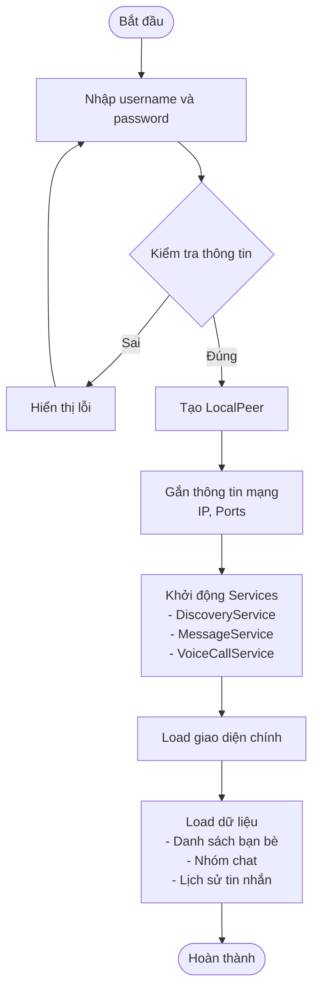

### 2.2. Quy Trình Gửi Tin Nhắn

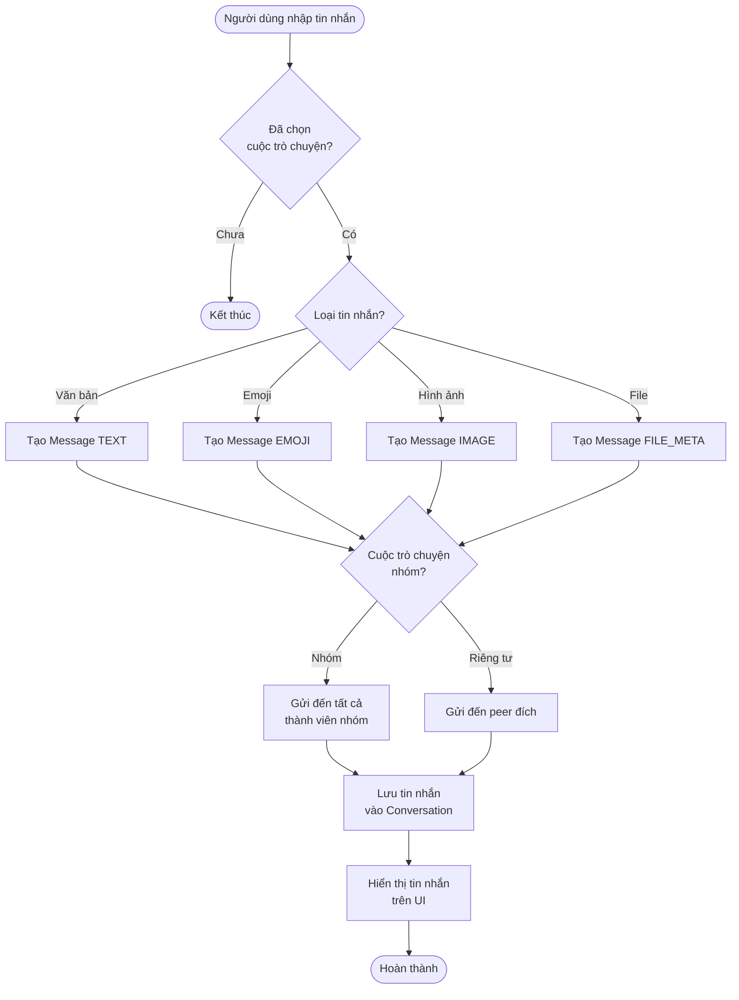

### 2.3. Quy Trình Thêm Bạn

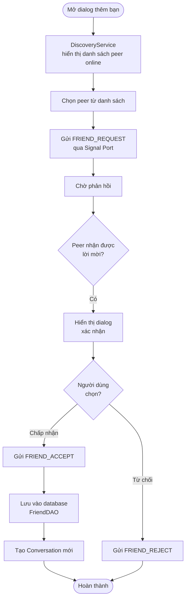

### 2.4. Quy Trình Peer Discovery

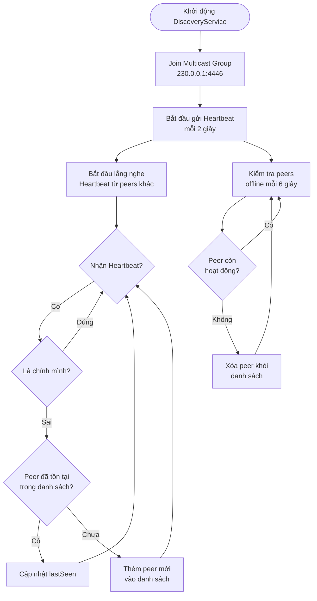

## 3. Sơ Đồ Lớp Tổng Quát (Class Diagram)

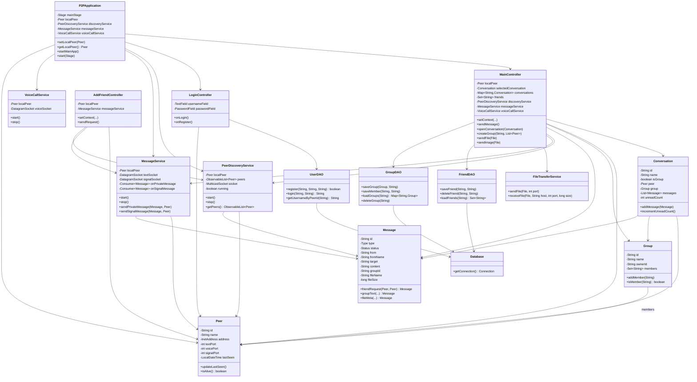

## 4. Biểu Đồ Tuần Tự (Sequence Diagrams)

### 4.1. Đăng Nhập và Khởi Tạo Hệ Thống

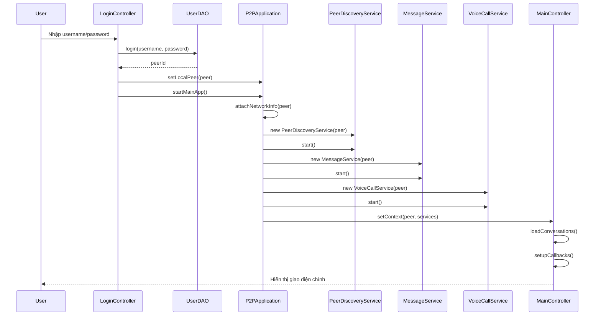

### 4.2. Gửi Tin Nhắn Riêng Tư

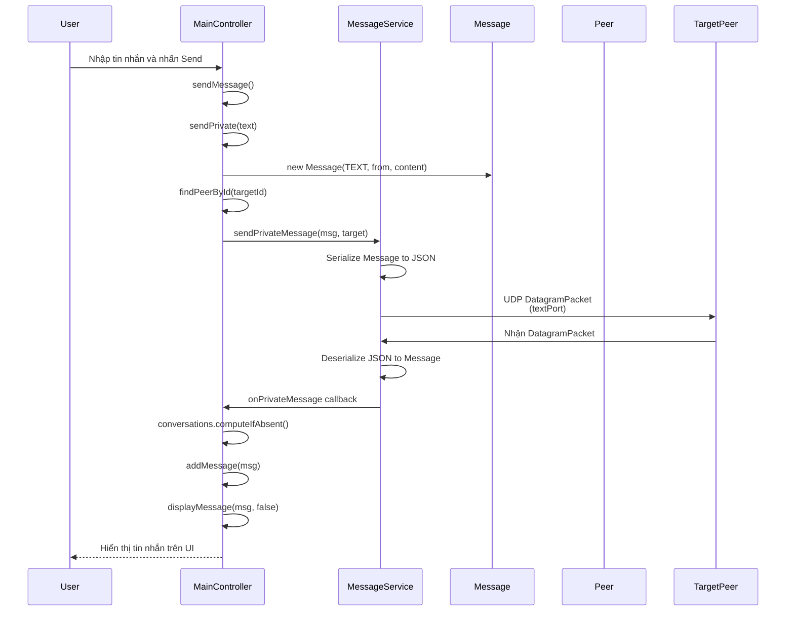

### 4.3. Thêm Bạn Bè

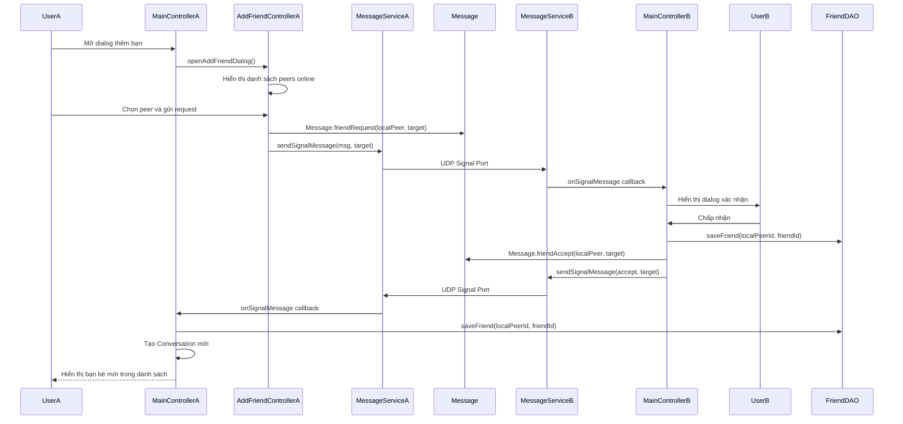

### 4.4. Peer Discovery (Khám Phá Peer)

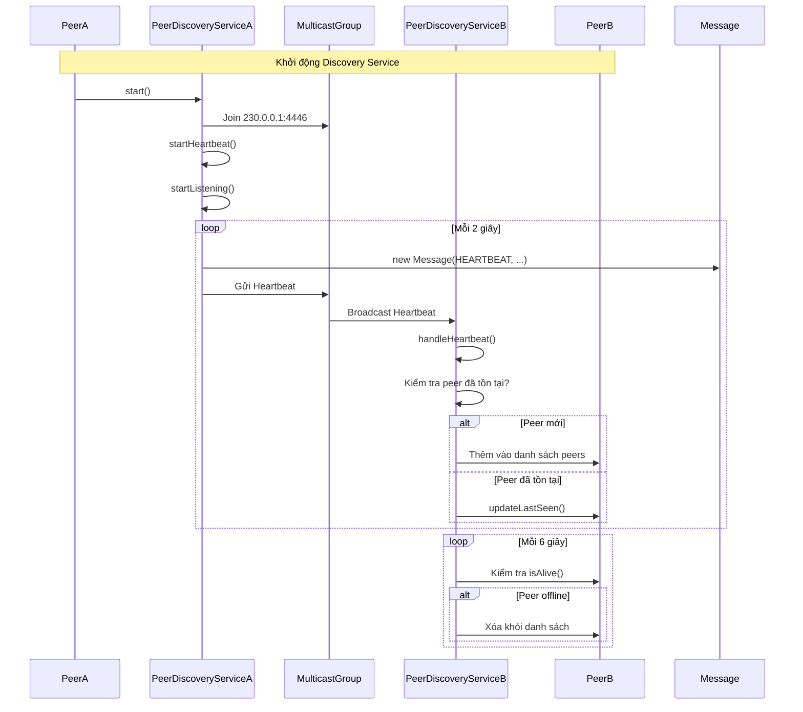

### 4.5. Gửi Tin Nhắn Nhóm

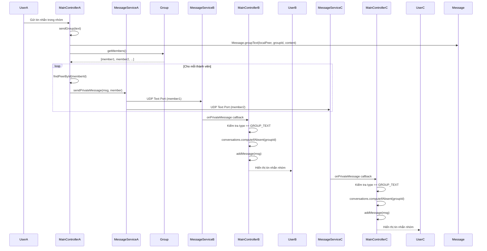

### 4.6. Gửi File

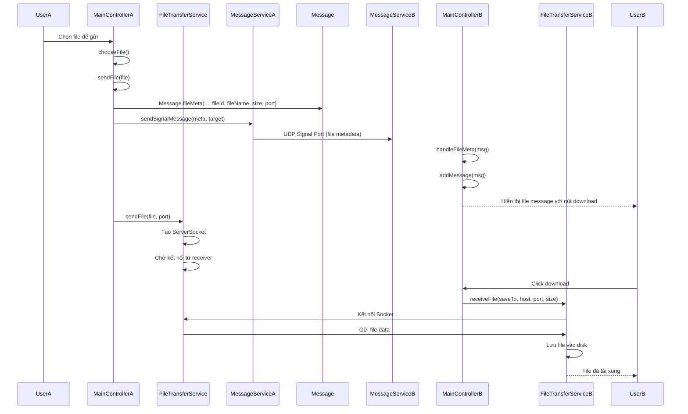

### 4.7. Thu Hồi Tin Nhắn

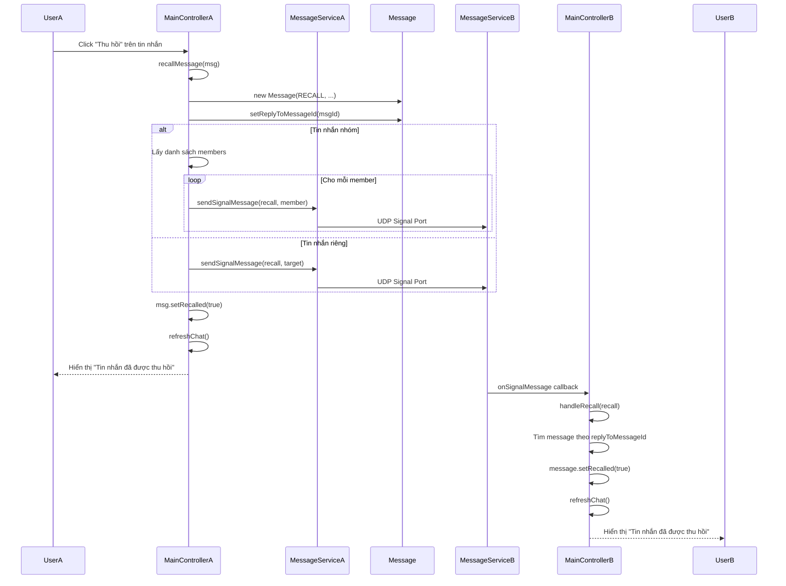

---

## Ghi Chú

### Kiến Trúc Hệ Thống

1. **P2P Architecture**: Hệ thống sử dụng kiến trúc peer-to-peer, không có server trung tâm
2. **UDP Communication**: Tất cả giao tiếp sử dụng UDP sockets
   - Text Port: Tin nhắn văn bản
   - Signal Port: Tín hiệu điều khiển (friend request, group invite, etc.)
   - Voice Port: Cuộc gọi thoại/video
3. **Multicast Discovery**: Sử dụng UDP Multicast để khám phá peers trong mạng LAN
4. **Database**: SQLite để lưu trữ thông tin người dùng, bạn bè, và nhóm chat

### Các Port Sử Dụng

- **Multicast Port**: 4446 (Discovery)
- **Text Port**: 52000-52999 (Random)
- **Voice Port**: TextPort + 1
- **Signal Port**: TextPort + 2
- **File Transfer Port**: 54000-54999 (Random)
- **Image Transfer Port**: 55000-55999 (Random)

### Luồng Dữ Liệu

1. **Heartbeat**: Gửi mỗi 2 giây qua Multicast
2. **Peer Timeout**: 6 giây không nhận heartbeat → coi là offline
3. **Message Types**: TEXT, IMAGE, FILE_META, GROUP_TEXT, FRIEND_REQUEST, etc.
4. **Signal Messages**: Điều khiển hệ thống (friend, group, recall, etc.)

