# Sơ Đồ Use Case - PeerTalk P2P Chat Application

## 1. Tổng Quan Use Case Diagram

```mermaid
graph TB
    User[👤 User]
    
    subgraph Authentication["🔐 Xác Thực"]
        UC1[Đăng ký]
        UC2[Đăng nhập]
    end
    
    subgraph Discovery["🔍 Khám Phá"]
        UC3[Khám phá peer]
    end
    
    subgraph FriendMgmt["👥 Quản Lý Bạn Bè"]
        UC4[Thêm bạn bè]
        UC5[Hủy kết bạn]
    end
    
    subgraph Messaging["💬 Nhắn Tin"]
        UC6[Gửi tin nhắn]
        UC7[Thu hồi tin nhắn]
        UC8[Trả lời tin nhắn]
    end
    
    subgraph FileSharing["📁 Chia Sẻ File"]
        UC9[Chia sẻ file]
    end
    
    subgraph Group["👨‍👩‍👧‍👦 Nhóm"]
        UC10[Tạo nhóm]
        UC11[Gửi tin nhắn nhóm]
        UC12[Quản lý nhóm]
    end
    
    subgraph Call["📞 Gọi"]
        UC13[Gọi thoại/video]
    end
    
    User --> UC1
    User --> UC2
    User --> UC3
    User --> UC4
    User --> UC5
    User --> UC6
    User --> UC7
    User --> UC8
    User --> UC9
    User --> UC10
    User --> UC11
    User --> UC12
    User --> UC13
```

---

## 2. Chi Tiết Use Case Với Include/Extend

### 2.1. Use Case: Đăng Ký (Register)

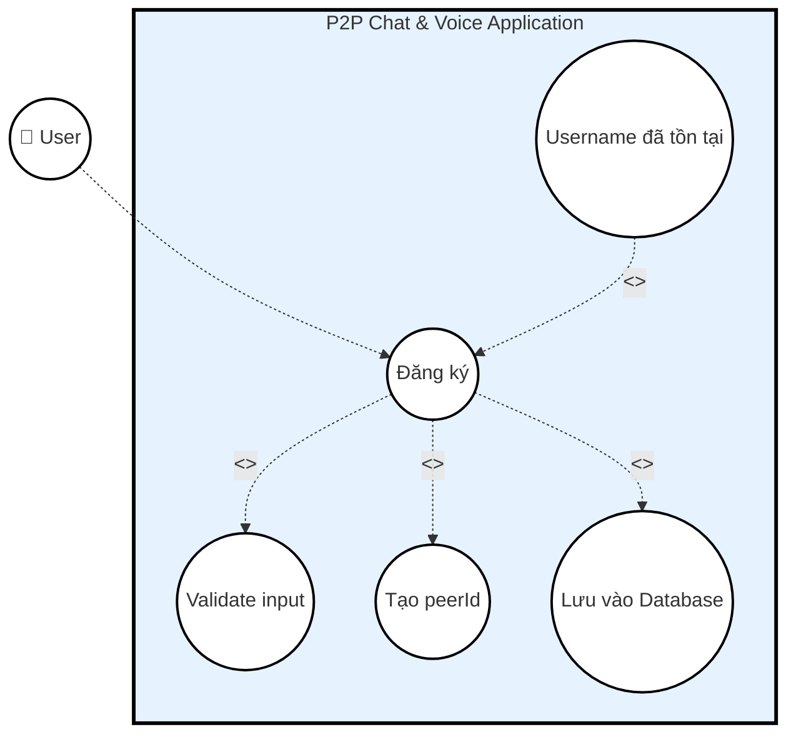

**Mô tả:**
- **Actor**: User
- **Use Case chính**: Đăng ký
- **Include**:
  - Validate input (kiểm tra username và password không rỗng)
  - Tạo peerId (UUID ngẫu nhiên)
  - Lưu vào Database (bảng users)
- **Extend**: Username đã tồn tại (hiển thị thông báo lỗi)

---

### 2.2. Use Case: Đăng Nhập (Login)

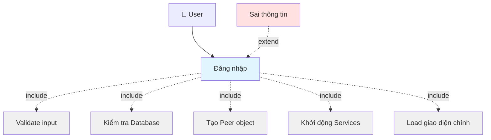

**Mô tả:**
- **Actor**: User
- **Use Case chính**: Đăng nhập
- **Include**:
  - Validate input
  - Kiểm tra Database (SELECT từ users)
  - Tạo Peer object (với peerId và username)
  - Khởi động Services (PeerDiscoveryService, MessageService, VoiceCallService)
  - Load giao diện chính (MainView)
- **Extend**: Sai thông tin (hiển thị thông báo lỗi)

---

### 2.3. Use Case: Khám Phá Peer (Peer Discovery)

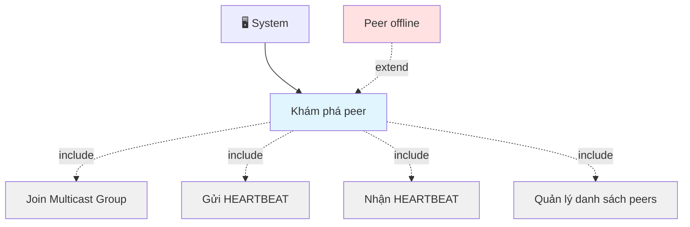

**Mô tả:**
- **Actor**: System (tự động)
- **Use Case chính**: Khám phá peer
- **Include**:
  - Join Multicast Group (230.0.0.1:4446)
  - Gửi HEARTBEAT (mỗi 2 giây)
  - Nhận HEARTBEAT (từ peers khác)
  - Quản lý danh sách peers (thêm mới, update, xóa offline)
- **Extend**: Peer offline (sau 6 giây không nhận HEARTBEAT)

---

### 2.4. Use Case: Thêm Bạn Bè (Add Friend)

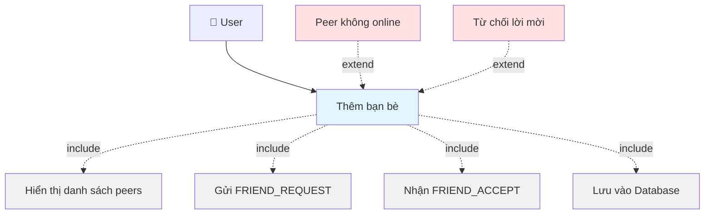

**Mô tả:**
- **Actor**: User
- **Use Case chính**: Thêm bạn bè
- **Include**:
  - Hiển thị danh sách peers (từ PeerDiscoveryService)
  - Gửi FRIEND_REQUEST (qua UDP signal port)
  - Nhận FRIEND_ACCEPT (từ peer)
  - Lưu vào Database (bảng friends)
- **Extend**: 
  - Peer không online (không thể gửi request)
  - Từ chối lời mời (peer từ chối, không lưu vào DB)

---

### 2.5. Use Case: Gửi Tin Nhắn (Send Message)

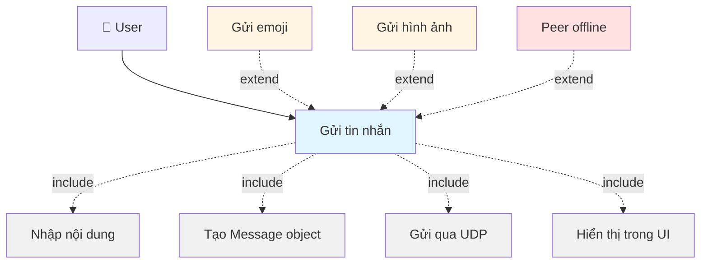

**Mô tả:**
- **Actor**: User
- **Use Case chính**: Gửi tin nhắn
- **Include**:
  - Nhập nội dung
  - Tạo Message object (Type: TEXT)
  - Gửi qua UDP (đến peer.textPort)
  - Hiển thị trong UI (màu xanh - sent)
- **Extend**:
  - Gửi emoji (content dạng :emoji_file:)
  - Gửi hình ảnh (Type: IMAGE)
  - Peer offline (không thể gửi)

---

### 2.6. Use Case: Chia Sẻ File (Share File)

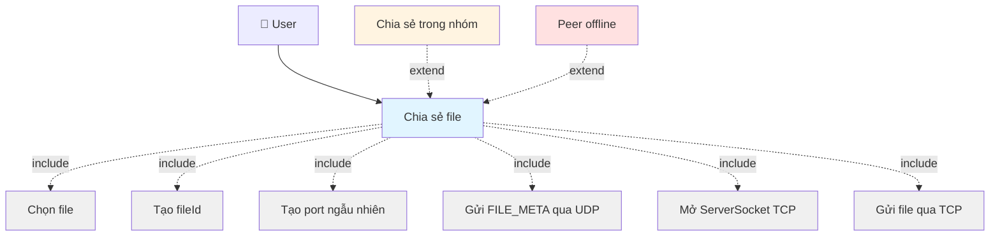

**Mô tả:**
- **Actor**: User
- **Use Case chính**: Chia sẻ file
- **Include**:
  - Chọn file (FileChooser)
  - Tạo fileId (UUID)
  - Tạo port ngẫu nhiên (54000-54999)
  - Gửi FILE_META qua UDP (metadata: fileName, size, port)
  - Mở ServerSocket TCP (trên port đã tạo)
  - Gửi file qua TCP (FileTransferService)
- **Extend**:
  - Chia sẻ trong nhóm (gửi FILE_META đến tất cả members)
  - Peer offline (không thể gửi)

---

### 2.7. Use Case: Thu Hồi Tin Nhắn (Recall Message)

```mermaid
graph TB
    User[👤 User]
    
    UC7[Thu hồi tin nhắn]
    Ext11[Tin nhắn đã quá lâu]
    Ext12[Tin nhắn trong nhóm]
    Inc27[Chọn tin nhắn]
    Inc28[Tạo RECALL message]
    Inc29[Gửi qua UDP]
    Inc30[Đánh dấu recalled]
    Inc31[Hiển thị "Đã thu hồi"]
    
    User --> UC7
    UC7 -.include.-> Inc27
    UC7 -.include.-> Inc28
    UC7 -.include.-> Inc29
    UC7 -.include.-> Inc30
    UC7 -.include.-> Inc31
    Ext11 -.extend.-> UC7
    Ext12 -.extend.-> UC7
    
    style UC7 fill:#E1F5FF
    style Ext11 fill:#FFE1E1
    style Ext12 fill:#FFF4E1
    style Inc27 fill:#F0F0F0
    style Inc28 fill:#F0F0F0
    style Inc29 fill:#F0F0F0
    style Inc30 fill:#F0F0F0
    style Inc31 fill:#F0F0F0
```

**Mô tả:**
- **Actor**: User
- **Use Case chính**: Thu hồi tin nhắn
- **Include**:
  - Chọn tin nhắn (right-click → "Thu hồi")
  - Tạo RECALL message (với replyToMessageId)
  - Gửi qua UDP (signal port)
  - Đánh dấu recalled (setRecalled(true))
  - Hiển thị "Đã thu hồi" (màu xám, in nghiêng)
- **Extend**:
  - Tin nhắn đã quá lâu (có thể không cho phép thu hồi)
  - Tin nhắn trong nhóm (gửi RECALL đến tất cả members)

---

### 2.8. Use Case: Tạo Nhóm (Create Group)

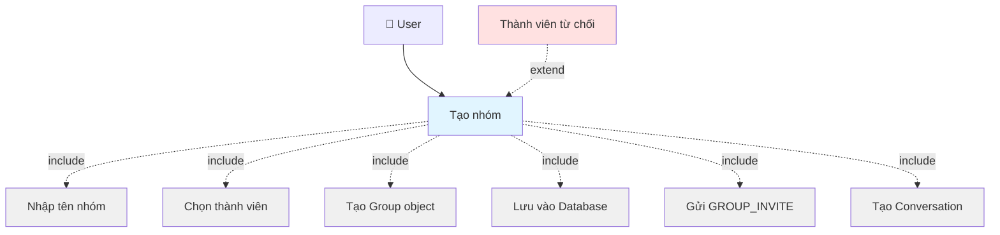

**Mô tả:**
- **Actor**: User
- **Use Case chính**: Tạo nhóm
- **Include**:
  - Nhập tên nhóm
  - Chọn thành viên (multi-select từ danh sách bạn bè)
  - Tạo Group object (với UUID id)
  - Lưu vào Database (bảng groups và group_members)
  - Gửi GROUP_INVITE (đến từng thành viên)
  - Tạo Conversation (cho nhóm)
- **Extend**: Thành viên từ chối (không tham gia nhóm)

---

### 2.9. Use Case: Gửi Tin Nhắn Nhóm (Send Group Message)

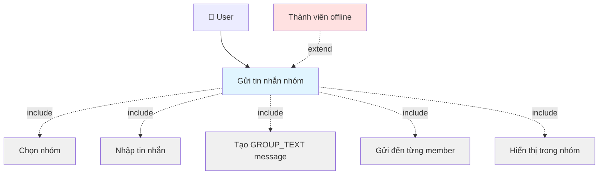

**Mô tả:**
- **Actor**: User
- **Use Case chính**: Gửi tin nhắn nhóm
- **Include**:
  - Chọn nhóm (từ danh sách conversations)
  - Nhập tin nhắn
  - Tạo GROUP_TEXT message (với groupId)
  - Gửi đến từng member (unicast, trừ người gửi)
  - Hiển thị trong nhóm (màu xanh)
- **Extend**: Thành viên offline (không nhận được tin nhắn)

---

### 2.10. Use Case: Gọi Thoại/Video (Voice/Video Call)

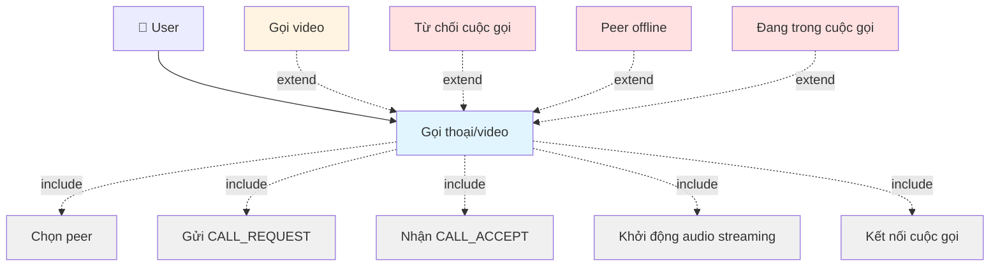

**Mô tả:**
- **Actor**: User
- **Use Case chính**: Gọi thoại/video
- **Include**:
  - Chọn peer (từ danh sách bạn bè)
  - Gửi CALL_REQUEST (qua UDP signal port)
  - Nhận CALL_ACCEPT (từ peer)
  - Khởi động audio streaming (mở microphone và speaker)
  - Kết nối cuộc gọi (gửi/nhận audio qua UDP voice port)
- **Extend**:
  - Gọi video (tương tự nhưng có video stream)
  - Từ chối cuộc gọi (gửi CALL_REJECT)
  - Peer offline (không thể gọi)
  - Đang trong cuộc gọi (không thể gọi mới)

---

### 2.11. Use Case: Trả Lời Tin Nhắn (Reply Message)

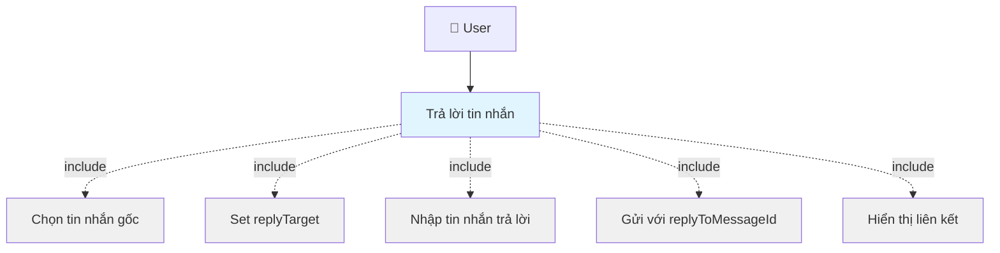

**Mô tả:**
- **Actor**: User
- **Use Case chính**: Trả lời tin nhắn
- **Include**:
  - Chọn tin nhắn gốc (right-click → "Trả lời")
  - Set replyTarget (lưu message gốc)
  - Nhập tin nhắn trả lời
  - Gửi với replyToMessageId (liên kết đến tin nhắn gốc)
  - Hiển thị liên kết (trong UI của peer nhận)

---

## 3. Use Case Diagram Tổng Hợp

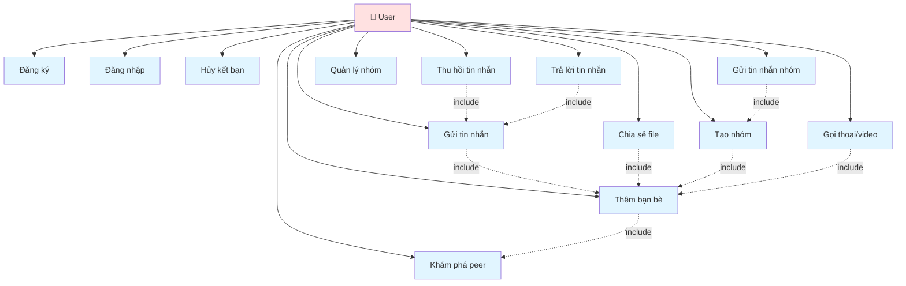

---

## 4. Bảng Tóm Tắt Use Cases

| ID | Use Case | Actor | Mô Tả Ngắn |
|----|----------|-------|------------|
| UC1 | Đăng ký | User | Tạo tài khoản mới |
| UC2 | Đăng nhập | User | Đăng nhập vào hệ thống |
| UC3 | Khám phá peer | System | Tự động phát hiện peers trong LAN |
| UC4 | Thêm bạn bè | User | Gửi và chấp nhận lời mời kết bạn |
| UC5 | Hủy kết bạn | User | Xóa bạn bè khỏi danh sách |
| UC6 | Gửi tin nhắn | User | Gửi tin nhắn văn bản/emoji/hình ảnh |
| UC7 | Thu hồi tin nhắn | User | Thu hồi tin nhắn đã gửi |
| UC8 | Trả lời tin nhắn | User | Trả lời một tin nhắn cụ thể |
| UC9 | Chia sẻ file | User | Gửi file đến bạn bè hoặc nhóm |
| UC10 | Tạo nhóm | User | Tạo nhóm chat mới |
| UC11 | Gửi tin nhắn nhóm | User | Gửi tin nhắn đến tất cả thành viên nhóm |
| UC12 | Quản lý nhóm | User | Rời nhóm, xóa nhóm, mời thành viên |
| UC13 | Gọi thoại/video | User | Thực hiện cuộc gọi 1-1 |

---

## 5. Quan Hệ Giữa Các Use Cases

### 5.1. Quan Hệ Include (Bắt Buộc)

Các use case này **luôn luôn** bao gồm các use case khác:

- **Đăng nhập** includes: Validate, Kiểm tra DB, Tạo Peer, Khởi động Services
- **Khám phá peer** includes: Join Multicast, Gửi/Nhận HEARTBEAT
- **Thêm bạn bè** includes: Hiển thị peers, Gửi REQUEST, Nhận ACCEPT
- **Gửi tin nhắn** includes: Nhập nội dung, Tạo Message, Gửi UDP, Hiển thị UI
- **Chia sẻ file** includes: Chọn file, Tạo fileId, Gửi META, Gửi qua TCP

### 5.2. Quan Hệ Extend (Tùy Chọn)

Các use case này **có thể** được mở rộng trong các điều kiện cụ thể:

- **Đăng ký** extends: Username đã tồn tại
- **Đăng nhập** extends: Sai thông tin
- **Thêm bạn bè** extends: Peer offline, Từ chối lời mời
- **Gửi tin nhắn** extends: Gửi emoji, Gửi hình ảnh, Peer offline
- **Chia sẻ file** extends: Chia sẻ trong nhóm, Peer offline
- **Gọi thoại** extends: Gọi video, Từ chối, Peer offline, Đang trong cuộc gọi

---

## 6. Ký Hiệu Sử Dụng

- **→** (Solid line): Association (Actor sử dụng Use Case)
- **-.include.->** (Dashed line với <<include>>): Include relationship
- **-.extend.->** (Dashed line với <<extend>>): Extend relationship
- **👤**: Actor (User)
- **🖥️**: System Actor

---

**Lưu ý**: Tất cả các sơ đồ trên sử dụng Mermaid syntax và có thể hiển thị trên các công cụ hỗ trợ Mermaid như GitHub, GitLab, hoặc các Markdown viewer.

