# 📊 Sơ Đồ Use Case và Luồng Hoạt Động - PeerTalk

## 📋 Mục Lục

1. [Sơ Đồ Use Case Tổng Quan](#1-sơ-đồ-use-case-tổng-quan)
2. [Luồng Hoạt Động Chi Tiết](#2-luồng-hoạt-động-chi-tiết)
   - [2.1. Đăng Ký và Đăng Nhập](#21-đăng-ký-và-đăng-nhập)
   - [2.2. Peer Discovery](#22-peer-discovery)
   - [2.3. Quản Lý Bạn Bè](#23-quản-lý-bạn-bè)
   - [2.4. Gửi/Nhận Tin Nhắn](#24-gửinhận-tin-nhắn)
   - [2.5. Gửi File và Hình Ảnh](#25-gửi-file-và-hình-ảnh)
   - [2.6. Quản Lý Nhóm](#26-quản-lý-nhóm)
   - [2.7. Gọi Thoại/Video](#27-gọi-thoạivideo)

---

## 1. Sơ Đồ Use Case Tổng Quan

### 1.1. Use Case Diagram

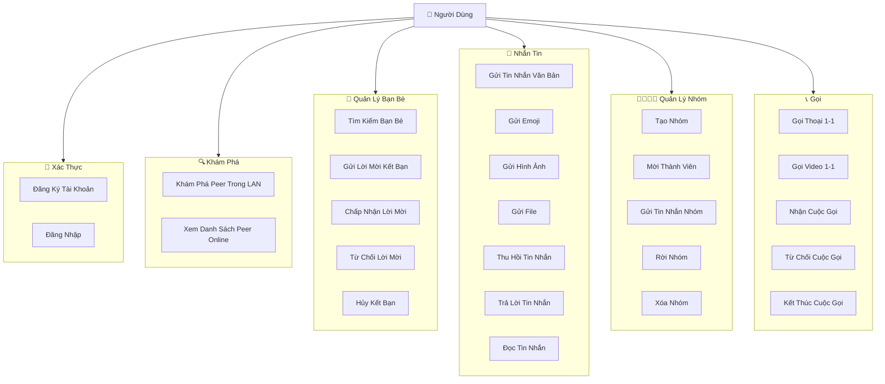
```mermaid
graph TB
    User[👤 Người Dùng]
    
    subgraph Authentication[🔐 Xác Thực]
        UC1[Đăng Ký Tài Khoản]
        UC2[Đăng Nhập]
    end
    
    subgraph Discovery[🔍 Khám Phá]
        UC3[Khám Phá Peer Trong LAN]
        UC4[Xem Danh Sách Peer Online]
    end
    
    subgraph Friend[👥 Quản Lý Bạn Bè]
        UC5[Tìm Kiếm Bạn Bè]
        UC6[Gửi Lời Mời Kết Bạn]
        UC7[Chấp Nhận Lời Mời]
        UC8[Từ Chối Lời Mời]
        UC9[Hủy Kết Bạn]
    end
    
    subgraph Chat[💬 Nhắn Tin]
        UC10[Gửi Tin Nhắn Văn Bản]
        UC11[Gửi Emoji]
        UC12[Gửi Hình Ảnh]
        UC13[Gửi File]
        UC14[Thu Hồi Tin Nhắn]
        UC15[Trả Lời Tin Nhắn]
        UC16[Đọc Tin Nhắn]
    end
    
    subgraph Group[👨‍👩‍👧‍👦 Quản Lý Nhóm]
        UC17[Tạo Nhóm]
        UC18[Mời Thành Viên]
        UC19[Gửi Tin Nhắn Nhóm]
        UC20[Rời Nhóm]
        UC21[Xóa Nhóm]
    end
    
    subgraph Call[📞 Gọi]
        UC22[Gọi Thoại 1-1]
        UC23[Gọi Video 1-1]
        UC24[Nhận Cuộc Gọi]
        UC25[Từ Chối Cuộc Gọi]
        UC26[Kết Thúc Cuộc Gọi]
    end
    
    User --> Authentication
    User --> Discovery
    User --> Friend
    User --> Chat
    User --> Group
    User --> Call
```

### 1.2. Mô Tả Use Case

#### 🔐 Xác Thực (Authentication)

| Use Case ID | Tên Use Case | Mô Tả |
|------------|--------------|-------|
| UC1 | Đăng Ký Tài Khoản | Người dùng tạo tài khoản mới với username và password |
| UC2 | Đăng Nhập | Người dùng đăng nhập với username và password đã đăng ký |

#### 🔍 Khám Phá (Discovery)

| Use Case ID | Tên Use Case | Mô Tả |
|------------|--------------|-------|
| UC3 | Khám Phá Peer Trong LAN | Hệ thống tự động phát hiện các peer online trong cùng mạng LAN |
| UC4 | Xem Danh Sách Peer Online | Hiển thị danh sách tất cả peer đang online |

#### 👥 Quản Lý Bạn Bè (Friend Management)

| Use Case ID | Tên Use Case | Mô Tả |
|------------|--------------|-------|
| UC5 | Tìm Kiếm Bạn Bè | Tìm kiếm peer theo tên hoặc ID |
| UC6 | Gửi Lời Mời Kết Bạn | Gửi lời mời kết bạn đến một peer |
| UC7 | Chấp Nhận Lời Mời | Chấp nhận lời mời kết bạn từ peer khác |
| UC8 | Từ Chối Lời Mời | Từ chối lời mời kết bạn |
| UC9 | Hủy Kết Bạn | Xóa bạn bè khỏi danh sách |

#### 💬 Nhắn Tin (Chat)

| Use Case ID | Tên Use Case | Mô Tả |
|------------|--------------|-------|
| UC10 | Gửi Tin Nhắn Văn Bản | Gửi tin nhắn text đến bạn bè |
| UC11 | Gửi Emoji | Gửi emoji trong tin nhắn |
| UC12 | Gửi Hình Ảnh | Gửi file hình ảnh (PNG, JPG, etc.) |
| UC13 | Gửi File | Gửi file tài liệu (PDF, DOC, ZIP, etc.) |
| UC14 | Thu Hồi Tin Nhắn | Thu hồi tin nhắn đã gửi |
| UC15 | Trả Lời Tin Nhắn | Trả lời một tin nhắn cụ thể |
| UC16 | Đọc Tin Nhắn | Đánh dấu tin nhắn đã đọc |

#### 👨‍👩‍👧‍👦 Quản Lý Nhóm (Group Management)

| Use Case ID | Tên Use Case | Mô Tả |
|------------|--------------|-------|
| UC17 | Tạo Nhóm | Tạo nhóm chat mới với tên và thành viên |
| UC18 | Mời Thành Viên | Mời bạn bè vào nhóm |
| UC19 | Gửi Tin Nhắn Nhóm | Gửi tin nhắn đến tất cả thành viên nhóm |
| UC20 | Rời Nhóm | Rời khỏi nhóm |
| UC21 | Xóa Nhóm | Xóa nhóm (chỉ owner) |

#### 📞 Gọi (Call)

| Use Case ID | Tên Use Case | Mô Tả |
|------------|--------------|-------|
| UC22 | Gọi Thoại 1-1 | Thực hiện cuộc gọi thoại với một peer |
| UC23 | Gọi Video 1-1 | Thực hiện cuộc gọi video với một peer |
| UC24 | Nhận Cuộc Gọi | Chấp nhận cuộc gọi đến |
| UC25 | Từ Chối Cuộc Gọi | Từ chối cuộc gọi đến |
| UC26 | Kết Thúc Cuộc Gọi | Kết thúc cuộc gọi đang diễn ra |

---

## 2. Luồng Hoạt Động Chi Tiết

### 2.1. Đăng Ký và Đăng Nhập

#### 2.1.1. Luồng Đăng Ký

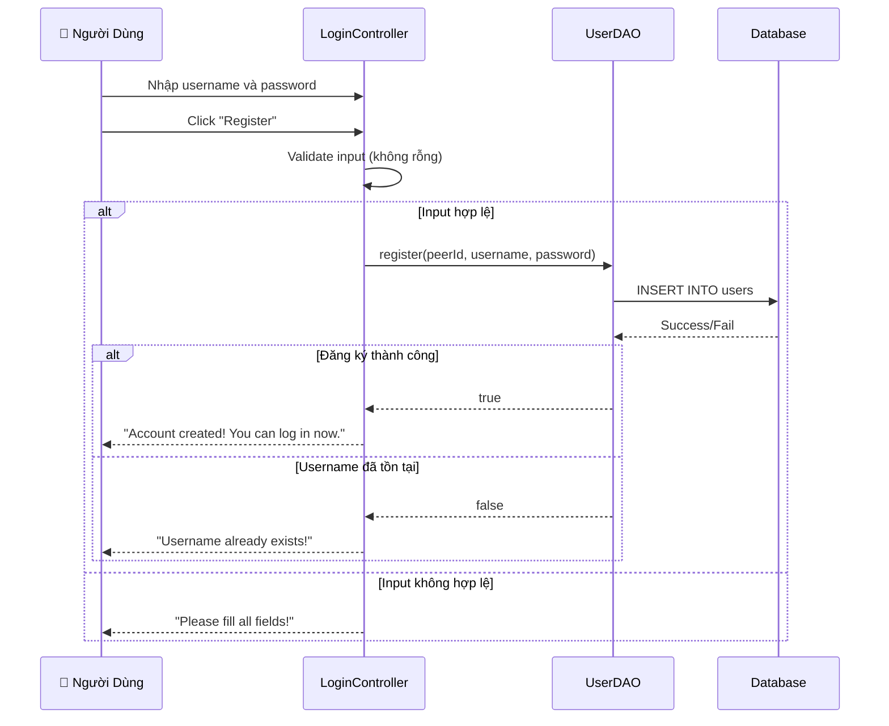
```mermaid
sequenceDiagram
    participant User as 👤 Người Dùng
    participant UI as LoginController
    participant DAO as UserDAO
    participant DB as Database
    
    User->>UI: Nhập username và password
    User->>UI: Click "Register"
    UI->>UI: Validate input (không rỗng)
    
    alt Input hợp lệ
        UI->>DAO: register(peerId, username, password)
        DAO->>DB: INSERT INTO users
        DB-->>DAO: Success/Fail
        alt Đăng ký thành công
            DAO-->>UI: true
            UI-->>User: "Account created! You can log in now."
        else Username đã tồn tại
            DAO-->>UI: false
            UI-->>User: "Username already exists!"
        end
    else Input không hợp lệ
        UI-->>User: "Please fill all fields!"
    end
```

#### 2.1.2. Luồng Đăng Nhập

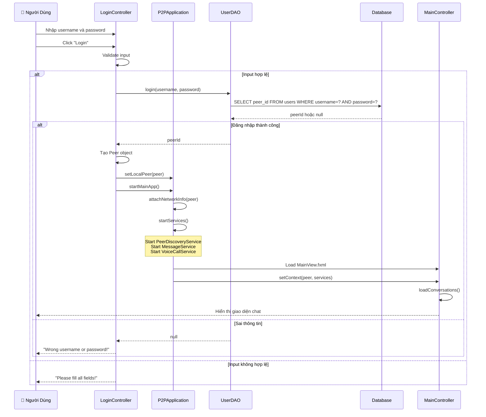
```mermaid
sequenceDiagram
    participant User as 👤 Người Dùng
    participant UI as LoginController
    participant App as P2PApplication
    participant DAO as UserDAO
    participant DB as Database
    participant Main as MainController
    
    User->>UI: Nhập username và password
    User->>UI: Click "Login"
    UI->>UI: Validate input
    
    alt Input hợp lệ
        UI->>DAO: login(username, password)
        DAO->>DB: SELECT peer_id FROM users WHERE username=? AND password=?
        DB-->>DAO: peerId hoặc null
        
        alt Đăng nhập thành công
            DAO-->>UI: peerId
            UI->>UI: Tạo Peer object
            UI->>App: setLocalPeer(peer)
            UI->>App: startMainApp()
            App->>App: attachNetworkInfo(peer)
            App->>App: startServices()
            Note over App: Start PeerDiscoveryService<br/>Start MessageService<br/>Start VoiceCallService
            App->>Main: Load MainView.fxml
            App->>Main: setContext(peer, services)
            Main->>Main: loadConversations()
            Main-->>User: Hiển thị giao diện chat
        else Sai thông tin
            DAO-->>UI: null
            UI-->>User: "Wrong username or password!"
        end
    else Input không hợp lệ
        UI-->>User: "Please fill all fields!"
    end
```

---

### 2.2. Peer Discovery

#### 2.2.1. Luồng Khám Phá Peer

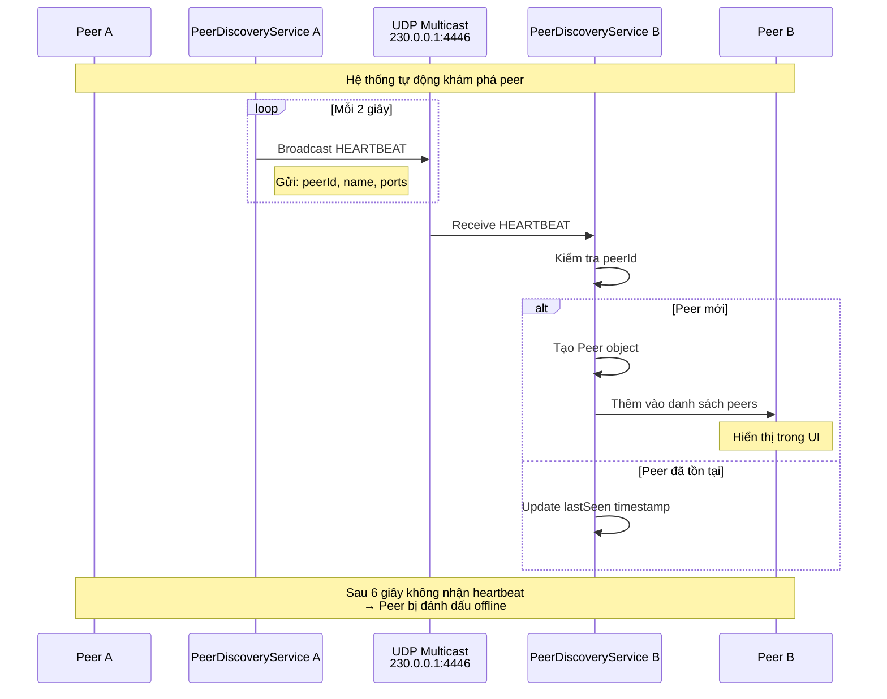
```mermaid
sequenceDiagram
    participant PeerA as Peer A
    participant DiscoveryA as PeerDiscoveryService A
    participant Multicast as UDP Multicast<br/>230.0.0.1:4446
    participant DiscoveryB as PeerDiscoveryService B
    participant PeerB as Peer B
    
    Note over PeerA,PeerB: Hệ thống tự động khám phá peer
    
    loop Mỗi 2 giây
        DiscoveryA->>Multicast: Broadcast HEARTBEAT
        Note right of DiscoveryA: Gửi: peerId, name, ports
    end
    
    Multicast->>DiscoveryB: Receive HEARTBEAT
    DiscoveryB->>DiscoveryB: Kiểm tra peerId
    alt Peer mới
        DiscoveryB->>DiscoveryB: Tạo Peer object
        DiscoveryB->>PeerB: Thêm vào danh sách peers
        Note over PeerB: Hiển thị trong UI
    else Peer đã tồn tại
        DiscoveryB->>DiscoveryB: Update lastSeen timestamp
    end
    
    Note over PeerA,PeerB: Sau 6 giây không nhận heartbeat<br/>→ Peer bị đánh dấu offline
```

#### 2.2.2. Activity Diagram - Peer Discovery

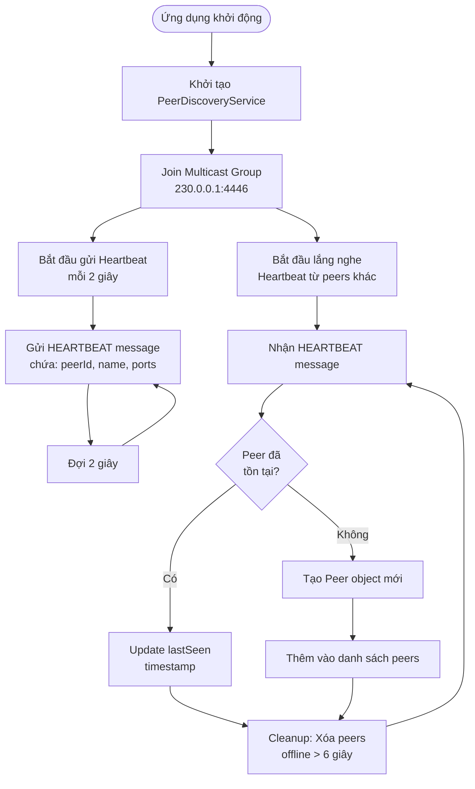
```mermaid
flowchart TD
    Start([Ứng dụng khởi động]) --> Init[Khởi tạo PeerDiscoveryService]
    Init --> Join[Join Multicast Group<br/>230.0.0.1:4446]
    Join --> StartHeartbeat[Bắt đầu gửi Heartbeat<br/>mỗi 2 giây]
    Join --> StartListen[Bắt đầu lắng nghe<br/>Heartbeat từ peers khác]
    
    StartHeartbeat --> SendHB[Gửi HEARTBEAT message<br/>chứa: peerId, name, ports]
    SendHB --> Wait2s[Đợi 2 giây]
    Wait2s --> SendHB
    
    StartListen --> Receive[Nhận HEARTBEAT message]
    Receive --> Check{Peer đã<br/>tồn tại?}
    Check -->|Có| Update[Update lastSeen<br/>timestamp]
    Check -->|Không| Create[Tạo Peer object mới]
    Create --> Add[Thêm vào danh sách peers]
    Update --> Cleanup
    Add --> Cleanup[Cleanup: Xóa peers<br/>offline > 6 giây]
    Cleanup --> Receive
```

---

### 2.3. Quản Lý Bạn Bè

#### 2.3.1. Luồng Gửi Lời Mời Kết Bạn

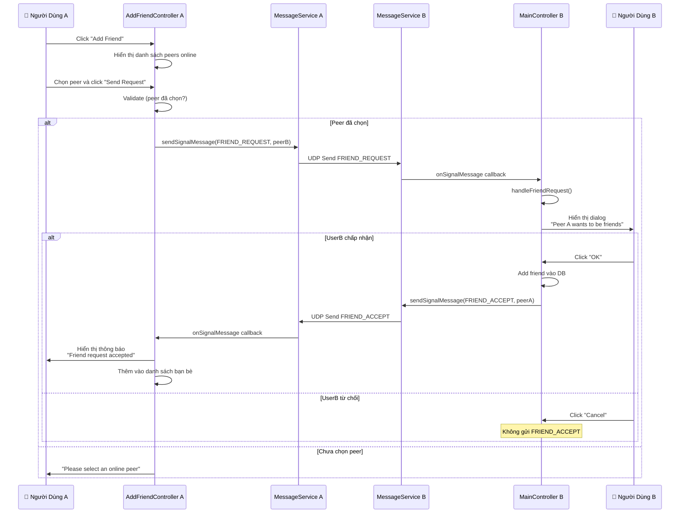
```mermaid
sequenceDiagram
    participant UserA as 👤 Người Dùng A
    participant UIA as AddFriendController A
    participant ServiceA as MessageService A
    participant ServiceB as MessageService B
    participant ControllerB as MainController B
    participant UserB as 👤 Người Dùng B
    
    UserA->>UIA: Click "Add Friend"
    UIA->>UIA: Hiển thị danh sách peers online
    UserA->>UIA: Chọn peer và click "Send Request"
    UIA->>UIA: Validate (peer đã chọn?)
    
    alt Peer đã chọn
        UIA->>ServiceA: sendSignalMessage(FRIEND_REQUEST, peerB)
        ServiceA->>ServiceB: UDP Send FRIEND_REQUEST
        ServiceB->>ControllerB: onSignalMessage callback
        ControllerB->>ControllerB: handleFriendRequest()
        ControllerB->>UserB: Hiển thị dialog<br/>"Peer A wants to be friends"
        
        alt UserB chấp nhận
            UserB->>ControllerB: Click "OK"
            ControllerB->>ControllerB: Add friend vào DB
            ControllerB->>ServiceB: sendSignalMessage(FRIEND_ACCEPT, peerA)
            ServiceB->>ServiceA: UDP Send FRIEND_ACCEPT
            ServiceA->>UIA: onSignalMessage callback
            UIA->>UserA: Hiển thị thông báo<br/>"Friend request accepted"
            UIA->>UIA: Thêm vào danh sách bạn bè
        else UserB từ chối
            UserB->>ControllerB: Click "Cancel"
            Note over ControllerB: Không gửi FRIEND_ACCEPT
        end
    else Chưa chọn peer
        UIA->>UserA: "Please select an online peer"
    end
```

#### 2.3.2. Activity Diagram - Quản Lý Bạn Bè

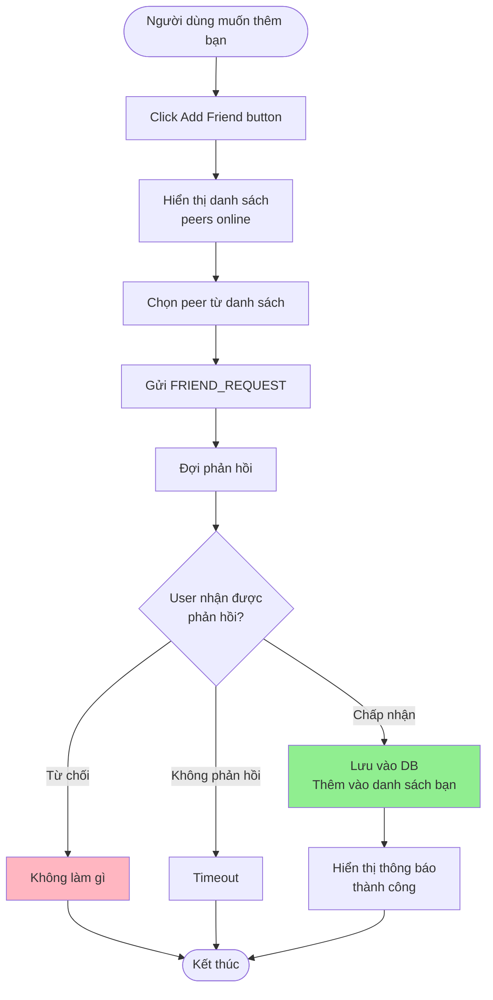
```mermaid
flowchart TD
    Start([Người dùng muốn thêm bạn]) --> Open[Click Add Friend button]
    Open --> ShowList[Hiển thị danh sách<br/>peers online]
    ShowList --> Select[Chọn peer từ danh sách]
    Select --> Send[Gửi FRIEND_REQUEST]
    Send --> Wait[Đợi phản hồi]
    
    Wait --> Response{User nhận được<br/>phản hồi?}
    Response -->|Chấp nhận| Accept[Lưu vào DB<br/>Thêm vào danh sách bạn]
    Response -->|Từ chối| Reject[Không làm gì]
    Response -->|Không phản hồi| Timeout[Timeout]
    
    Accept --> Success[Hiển thị thông báo<br/>thành công]
    Reject --> End([Kết thúc])
    Timeout --> End
    Success --> End
    
    style Accept fill:#90EE90
    style Reject fill:#FFB6C1
```

---

### 2.4. Gửi/Nhận Tin Nhắn

#### 2.4.1. Luồng Gửi Tin Nhắn Văn Bản

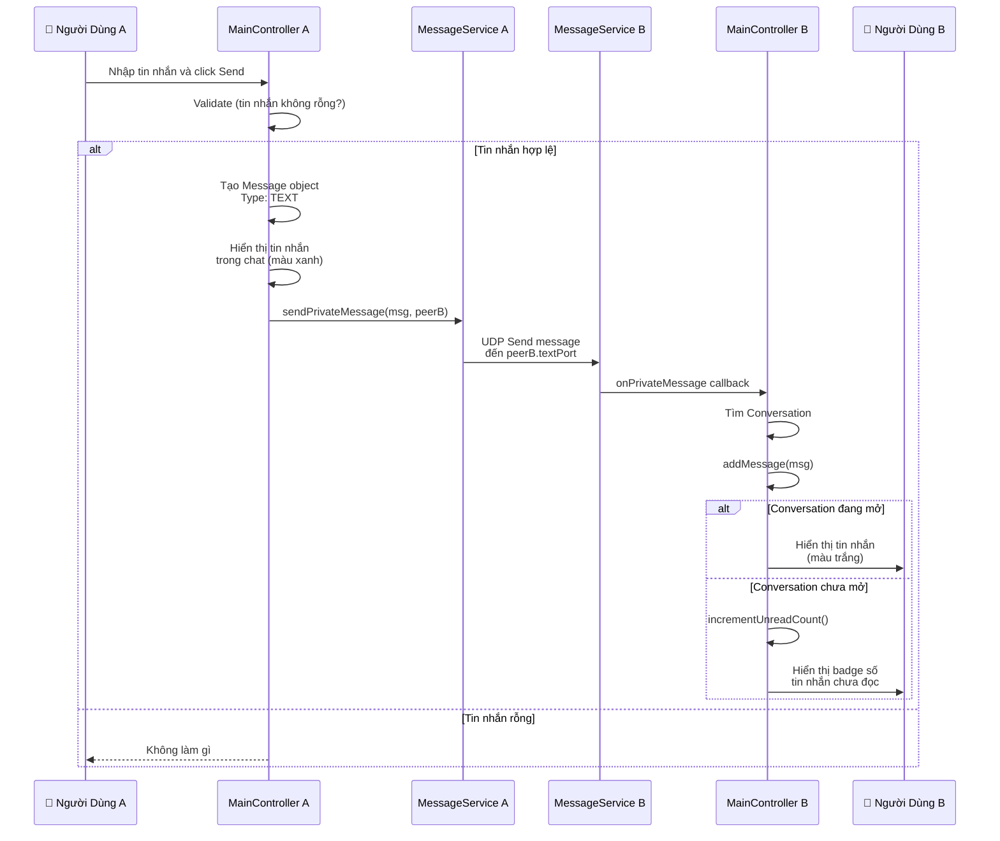
```mermaid
sequenceDiagram
    participant UserA as 👤 Người Dùng A
    participant ControllerA as MainController A
    participant ServiceA as MessageService A
    participant ServiceB as MessageService B
    participant ControllerB as MainController B
    participant UserB as 👤 Người Dùng B
    
    UserA->>ControllerA: Nhập tin nhắn và click Send
    ControllerA->>ControllerA: Validate (tin nhắn không rỗng?)
    
    alt Tin nhắn hợp lệ
        ControllerA->>ControllerA: Tạo Message object<br/>Type: TEXT
        ControllerA->>ControllerA: Hiển thị tin nhắn<br/>trong chat (màu xanh)
        ControllerA->>ServiceA: sendPrivateMessage(msg, peerB)
        ServiceA->>ServiceB: UDP Send message<br/>đến peerB.textPort
        ServiceB->>ControllerB: onPrivateMessage callback
        ControllerB->>ControllerB: Tìm Conversation
        ControllerB->>ControllerB: addMessage(msg)
        
        alt Conversation đang mở
            ControllerB->>UserB: Hiển thị tin nhắn<br/>(màu trắng)
        else Conversation chưa mở
            ControllerB->>ControllerB: incrementUnreadCount()
            ControllerB->>UserB: Hiển thị badge số<br/>tin nhắn chưa đọc
        end
    else Tin nhắn rỗng
        ControllerA-->>UserA: Không làm gì
    end
```

#### 2.4.2. Luồng Gửi Emoji

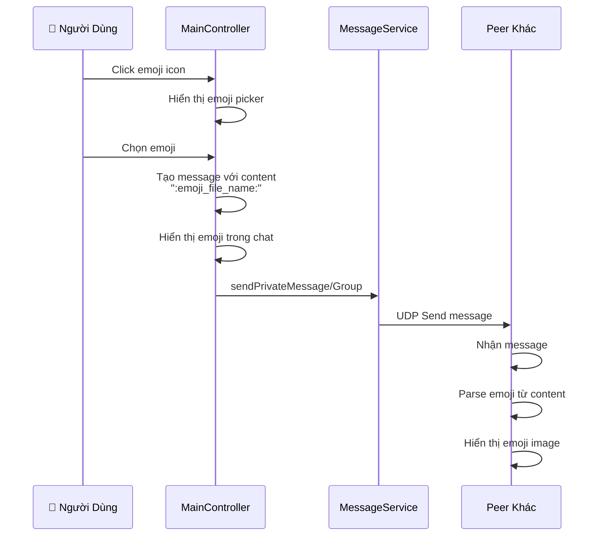
```mermaid
sequenceDiagram
    participant User as 👤 Người Dùng
    participant Controller as MainController
    participant Service as MessageService
    participant Peer as Peer Khác
    
    User->>Controller: Click emoji icon
    Controller->>Controller: Hiển thị emoji picker
    User->>Controller: Chọn emoji
    Controller->>Controller: Tạo message với content<br/>":emoji_file_name:"
    Controller->>Controller: Hiển thị emoji trong chat
    Controller->>Service: sendPrivateMessage/Group
    Service->>Peer: UDP Send message
    
    Peer->>Peer: Nhận message
    Peer->>Peer: Parse emoji từ content
    Peer->>Peer: Hiển thị emoji image
```

#### 2.4.3. Activity Diagram - Gửi Tin Nhắn

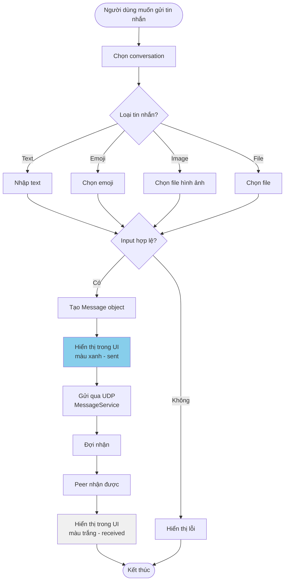
```mermaid
flowchart TD
    Start([Người dùng muốn gửi tin nhắn]) --> Select[Chọn conversation]
    Select --> Type{Loại tin nhắn?}
    
    Type -->|Text| Text[Nhập text]
    Type -->|Emoji| Emoji[Chọn emoji]
    Type -->|Image| Image[Chọn file hình ảnh]
    Type -->|File| File[Chọn file]
    
    Text --> Validate{Input hợp lệ?}
    Emoji --> Validate
    Image --> Validate
    File --> Validate
    
    Validate -->|Có| Create[Tạo Message object]
    Validate -->|Không| Error[Hiển thị lỗi]
    
    Create --> Display[Hiển thị trong UI<br/>màu xanh - sent]
    Display --> Send[Gửi qua UDP<br/>MessageService]
    Send --> Wait[Đợi nhận]
    
    Wait --> Receive[Peer nhận được]
    Receive --> Show[Hiển thị trong UI<br/>màu trắng - received]
    Show --> End([Kết thúc])
    Error --> End
    
    style Display fill:#87CEEB
    style Show fill:#F0F0F0
```

---

### 2.5. Gửi File và Hình Ảnh

#### 2.5.1. Luồng Gửi File

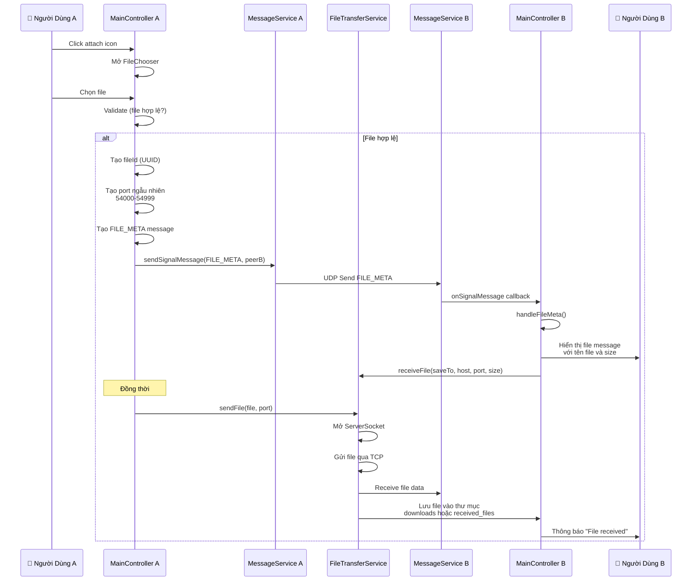
```mermaid
sequenceDiagram
    participant UserA as 👤 Người Dùng A
    participant ControllerA as MainController A
    participant ServiceA as MessageService A
    participant FileService as FileTransferService
    participant ServiceB as MessageService B
    participant ControllerB as MainController B
    participant UserB as 👤 Người Dùng B
    
    UserA->>ControllerA: Click attach icon
    ControllerA->>ControllerA: Mở FileChooser
    UserA->>ControllerA: Chọn file
    ControllerA->>ControllerA: Validate (file hợp lệ?)
    
    alt File hợp lệ
        ControllerA->>ControllerA: Tạo fileId (UUID)
        ControllerA->>ControllerA: Tạo port ngẫu nhiên<br/>54000-54999
        ControllerA->>ControllerA: Tạo FILE_META message
        ControllerA->>ServiceA: sendSignalMessage(FILE_META, peerB)
        ServiceA->>ServiceB: UDP Send FILE_META
        ServiceB->>ControllerB: onSignalMessage callback
        ControllerB->>ControllerB: handleFileMeta()
        ControllerB->>UserB: Hiển thị file message<br/>với tên file và size
        ControllerB->>FileService: receiveFile(saveTo, host, port, size)
        
        Note over ControllerA: Đồng thời
        ControllerA->>FileService: sendFile(file, port)
        FileService->>FileService: Mở ServerSocket
        FileService->>FileService: Gửi file qua TCP
        FileService->>ServiceB: Receive file data
        FileService->>ControllerB: Lưu file vào thư mục<br/>downloads hoặc received_files
        ControllerB->>UserB: Thông báo "File received"
    end
```

#### 2.5.2. Luồng Gửi Hình Ảnh

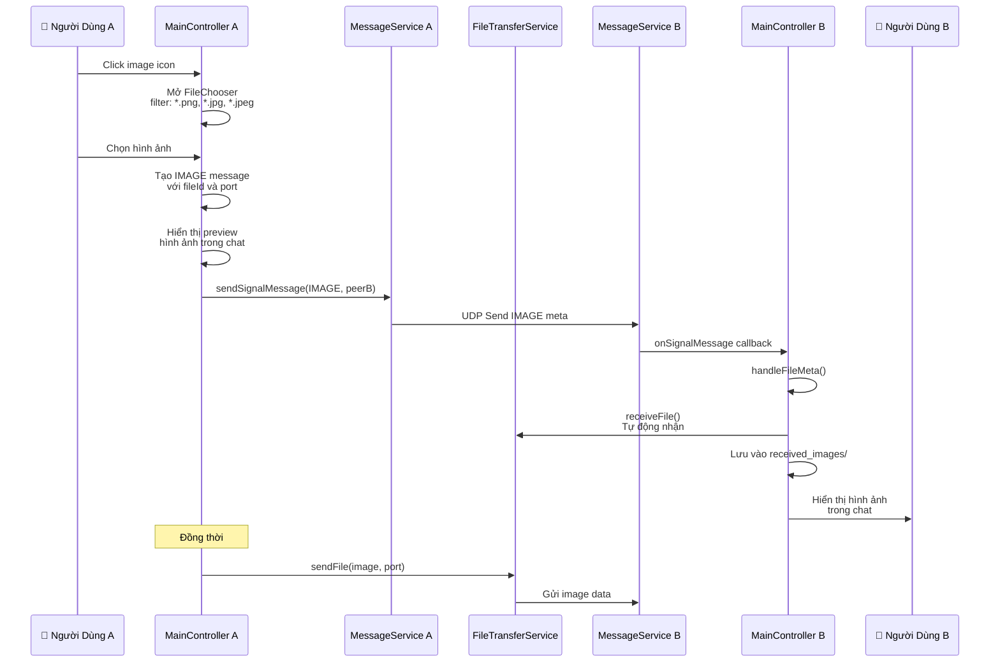
```mermaid
sequenceDiagram
    participant UserA as 👤 Người Dùng A
    participant ControllerA as MainController A
    participant ServiceA as MessageService A
    participant FileService as FileTransferService
    participant ServiceB as MessageService B
    participant ControllerB as MainController B
    participant UserB as 👤 Người Dùng B
    
    UserA->>ControllerA: Click image icon
    ControllerA->>ControllerA: Mở FileChooser<br/>filter: *.png, *.jpg, *.jpeg
    UserA->>ControllerA: Chọn hình ảnh
    ControllerA->>ControllerA: Tạo IMAGE message<br/>với fileId và port
    ControllerA->>ControllerA: Hiển thị preview<br/>hình ảnh trong chat
    ControllerA->>ServiceA: sendSignalMessage(IMAGE, peerB)
    ServiceA->>ServiceB: UDP Send IMAGE meta
    ServiceB->>ControllerB: onSignalMessage callback
    ControllerB->>ControllerB: handleFileMeta()
    ControllerB->>FileService: receiveFile()<br/>Tự động nhận
    ControllerB->>ControllerB: Lưu vào received_images/
    ControllerB->>UserB: Hiển thị hình ảnh<br/>trong chat
    
    Note over ControllerA: Đồng thời
    ControllerA->>FileService: sendFile(image, port)
    FileService->>ServiceB: Gửi image data
```

---

### 2.6. Quản Lý Nhóm

#### 2.6.1. Luồng Tạo Nhóm

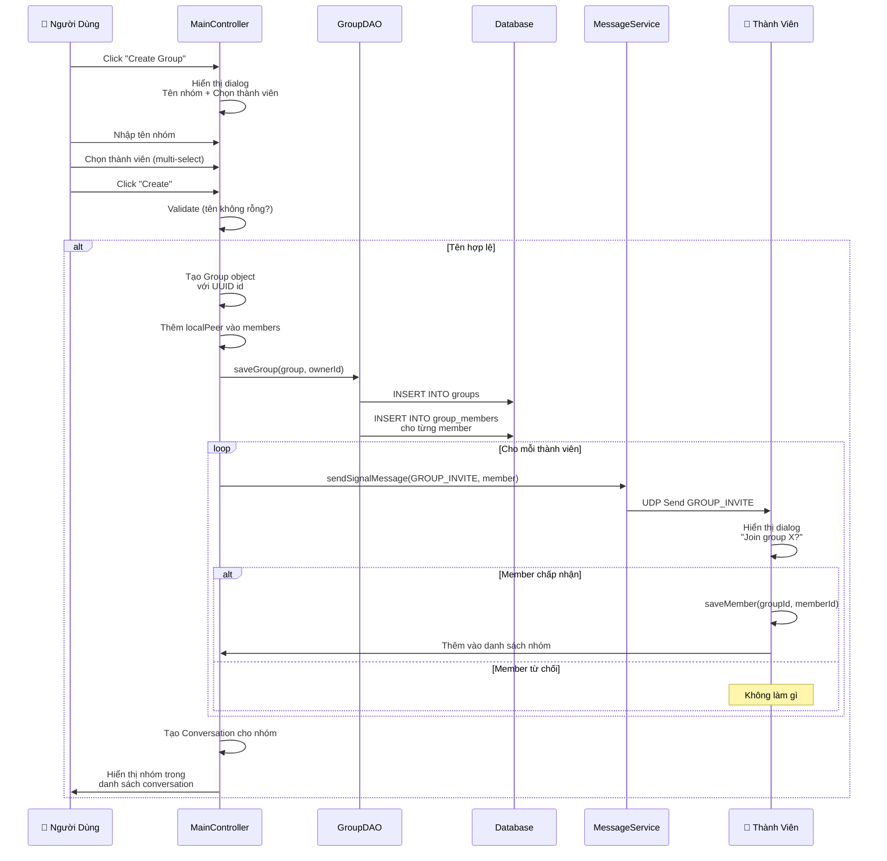
```mermaid
sequenceDiagram
    participant User as 👤 Người Dùng
    participant Controller as MainController
    participant DAO as GroupDAO
    participant DB as Database
    participant Service as MessageService
    participant Members as 👥 Thành Viên
    
    User->>Controller: Click "Create Group"
    Controller->>Controller: Hiển thị dialog<br/>Tên nhóm + Chọn thành viên
    User->>Controller: Nhập tên nhóm
    User->>Controller: Chọn thành viên (multi-select)
    User->>Controller: Click "Create"
    
    Controller->>Controller: Validate (tên không rỗng?)
    alt Tên hợp lệ
        Controller->>Controller: Tạo Group object<br/>với UUID id
        Controller->>Controller: Thêm localPeer vào members
        Controller->>DAO: saveGroup(group, ownerId)
        DAO->>DB: INSERT INTO groups
        DAO->>DB: INSERT INTO group_members<br/>cho từng member
        
        loop Cho mỗi thành viên
            Controller->>Service: sendSignalMessage(GROUP_INVITE, member)
            Service->>Members: UDP Send GROUP_INVITE
            Members->>Members: Hiển thị dialog<br/>"Join group X?"
            
            alt Member chấp nhận
                Members->>Members: saveMember(groupId, memberId)
                Members->>Controller: Thêm vào danh sách nhóm
            else Member từ chối
                Note over Members: Không làm gì
            end
        end
        
        Controller->>Controller: Tạo Conversation cho nhóm
        Controller->>User: Hiển thị nhóm trong<br/>danh sách conversation
    end
```

#### 2.6.2. Luồng Gửi Tin Nhắn Nhóm

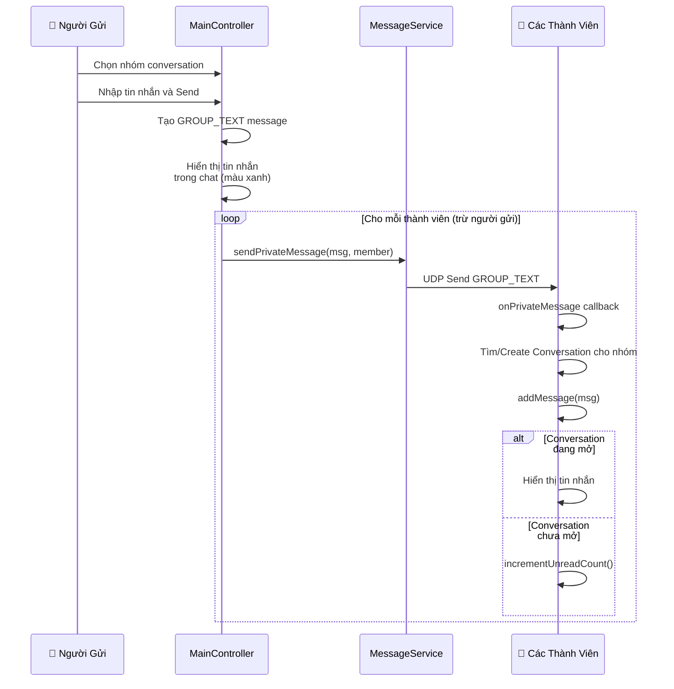
```mermaid
sequenceDiagram
    participant User as 👤 Người Gửi
    participant Controller as MainController
    participant Service as MessageService
    participant Members as 👥 Các Thành Viên
    
    User->>Controller: Chọn nhóm conversation
    User->>Controller: Nhập tin nhắn và Send
    Controller->>Controller: Tạo GROUP_TEXT message
    Controller->>Controller: Hiển thị tin nhắn<br/>trong chat (màu xanh)
    
    loop Cho mỗi thành viên (trừ người gửi)
        Controller->>Service: sendPrivateMessage(msg, member)
        Service->>Members: UDP Send GROUP_TEXT
        Members->>Members: onPrivateMessage callback
        Members->>Members: Tìm/Create Conversation cho nhóm
        Members->>Members: addMessage(msg)
        
        alt Conversation đang mở
            Members->>Members: Hiển thị tin nhắn
        else Conversation chưa mở
            Members->>Members: incrementUnreadCount()
        end
    end
```

#### 2.6.3. Activity Diagram - Quản Lý Nhóm

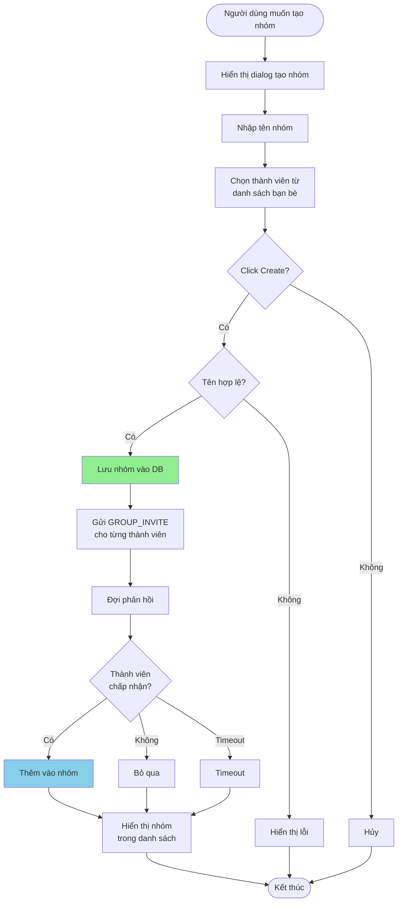
```mermaid
flowchart TD
    Start([Người dùng muốn tạo nhóm]) --> Dialog[Hiển thị dialog tạo nhóm]
    Dialog --> Input[Nhập tên nhóm]
    Input --> Select[Chọn thành viên từ<br/>danh sách bạn bè]
    Select --> Create{Click Create?}
    
    Create -->|Có| Validate{Tên hợp lệ?}
    Create -->|Không| Cancel[Hủy]
    
    Validate -->|Có| Save[Lưu nhóm vào DB]
    Validate -->|Không| Error[Hiển thị lỗi]
    
    Save --> Invite[Gửi GROUP_INVITE<br/>cho từng thành viên]
    Invite --> Wait[Đợi phản hồi]
    Wait --> Response{Thành viên<br/>chấp nhận?}
    
    Response -->|Có| Add[Thêm vào nhóm]
    Response -->|Không| Skip[Bỏ qua]
    Response -->|Timeout| Timeout[Timeout]
    
    Add --> Show[Hiển thị nhóm<br/>trong danh sách]
    Skip --> Show
    Timeout --> Show
    Show --> End([Kết thúc])
    Cancel --> End
    Error --> End
    
    style Save fill:#90EE90
    style Add fill:#87CEEB
```

---

### 2.7. Gọi Thoại/Video

#### 2.7.1. Luồng Khởi Tạo Cuộc Gọi

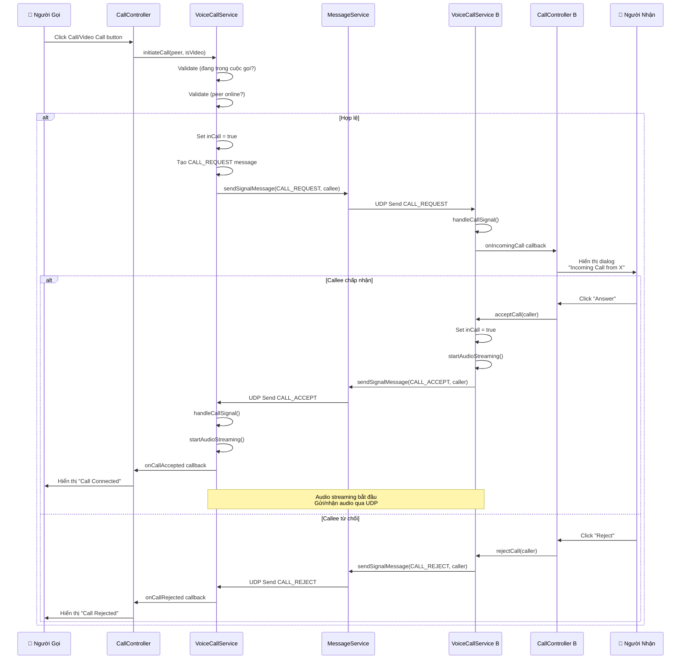
```mermaid
sequenceDiagram
    participant Caller as 👤 Người Gọi
    participant CallController as CallController
    participant VoiceService as VoiceCallService
    participant MessageService as MessageService
    participant CalleeService as VoiceCallService B
    participant CalleeController as CallController B
    participant Callee as 👤 Người Nhận
    
    Caller->>CallController: Click Call/Video Call button
    CallController->>VoiceService: initiateCall(peer, isVideo)
    VoiceService->>VoiceService: Validate (đang trong cuộc gọi?)
    VoiceService->>VoiceService: Validate (peer online?)
    
    alt Hợp lệ
        VoiceService->>VoiceService: Set inCall = true
        VoiceService->>VoiceService: Tạo CALL_REQUEST message
        VoiceService->>MessageService: sendSignalMessage(CALL_REQUEST, callee)
        MessageService->>CalleeService: UDP Send CALL_REQUEST
        CalleeService->>CalleeService: handleCallSignal()
        CalleeService->>CalleeController: onIncomingCall callback
        CalleeController->>Callee: Hiển thị dialog<br/>"Incoming Call from X"
        
        alt Callee chấp nhận
            Callee->>CalleeController: Click "Answer"
            CalleeController->>CalleeService: acceptCall(caller)
            CalleeService->>CalleeService: Set inCall = true
            CalleeService->>CalleeService: startAudioStreaming()
            CalleeService->>MessageService: sendSignalMessage(CALL_ACCEPT, caller)
            MessageService->>VoiceService: UDP Send CALL_ACCEPT
            VoiceService->>VoiceService: handleCallSignal()
            VoiceService->>VoiceService: startAudioStreaming()
            VoiceService->>CallController: onCallAccepted callback
            CallController->>Caller: Hiển thị "Call Connected"
            
            Note over VoiceService,CalleeService: Audio streaming bắt đầu<br/>Gửi/nhận audio qua UDP
        else Callee từ chối
            Callee->>CalleeController: Click "Reject"
            CalleeController->>CalleeService: rejectCall(caller)
            CalleeService->>MessageService: sendSignalMessage(CALL_REJECT, caller)
            MessageService->>VoiceService: UDP Send CALL_REJECT
            VoiceService->>CallController: onCallRejected callback
            CallController->>Caller: Hiển thị "Call Rejected"
        end
    end
```

#### 2.7.2. Luồng Kết Thúc Cuộc Gọi

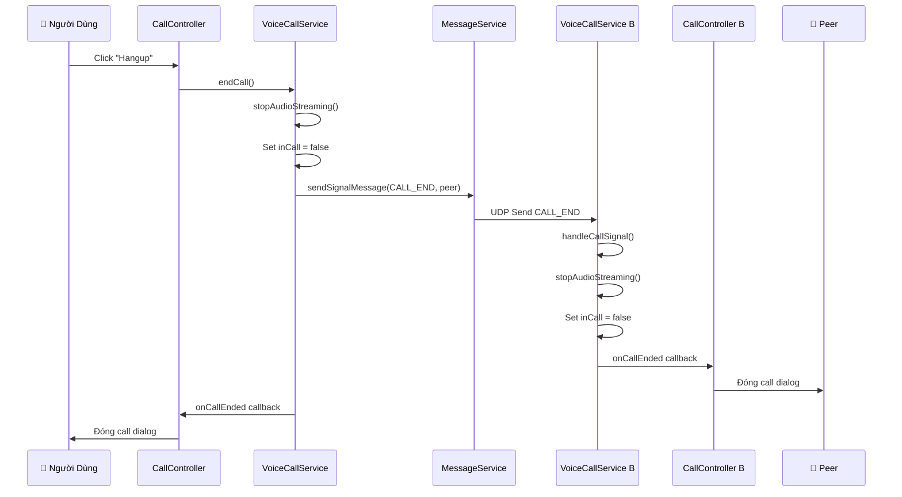
```mermaid
sequenceDiagram
    participant User as 👤 Người Dùng
    participant Controller as CallController
    participant VoiceService as VoiceCallService
    participant MessageService as MessageService
    participant PeerService as VoiceCallService B
    participant PeerController as CallController B
    participant Peer as 👤 Peer
    
    User->>Controller: Click "Hangup"
    Controller->>VoiceService: endCall()
    VoiceService->>VoiceService: stopAudioStreaming()
    VoiceService->>VoiceService: Set inCall = false
    VoiceService->>MessageService: sendSignalMessage(CALL_END, peer)
    MessageService->>PeerService: UDP Send CALL_END
    PeerService->>PeerService: handleCallSignal()
    PeerService->>PeerService: stopAudioStreaming()
    PeerService->>PeerService: Set inCall = false
    PeerService->>PeerController: onCallEnded callback
    PeerController->>Peer: Đóng call dialog
    VoiceService->>Controller: onCallEnded callback
    Controller->>User: Đóng call dialog
```

#### 2.7.3. Activity Diagram - Gọi Thoại/Video

```mermaid
flowchart TD
    Start([Người dùng muốn gọi]) --> Select[Chọn peer từ<br/>danh sách bạn bè]
    Select --> Type{Loại cuộc gọi?}
    Type -->|Voice| Voice[Gọi thoại]
    Type -->|Video| Video[Gọi video]
    
    Voice --> Check1{Đang trong<br/>cuộc gọi?}
    Video --> Check1
    
    Check1 -->|Có| Error1[Hiển thị lỗi<br/>"Already in call"]
    Check1 -->|Không| Check2{Peer online?}
    
    Check2 -->|Không| Error2[Hiển thị lỗi<br/>"User is offline"]
    Check2 -->|Có| Send[Gửi CALL_REQUEST]
    
    Send --> Wait[Đợi phản hồi]
    Wait --> Response{Phản hồi?}
    
    Response -->|Chấp nhận| Accept[Gửi CALL_ACCEPT]
    Response -->|Từ chối| Reject[Gửi CALL_REJECT]
    Response -->|Timeout| Timeout[Timeout]
    
    Accept --> Stream[Khởi động audio streaming]
    Stream --> Connected[Cuộc gọi kết nối]
    Connected --> Hangup{Click Hangup?}
    
    Reject --> End1[Hiển thị "Call Rejected"]
    Timeout --> End1
    Error1 --> End2[Kết thúc]
    Error2 --> End2
    End1 --> End2
    
    Hangup -->|Có| EndCall[Gửi CALL_END]
    EndCall --> Stop[Dừng audio streaming]
    Stop --> Close[Đóng call dialog]
    Close --> End2([Kết thúc])
    
    style Accept fill:#90EE90
    style Connected fill:#87CEEB
    style Reject fill:#FFB6C1
```

#### 2.7.4. Luồng Audio Streaming

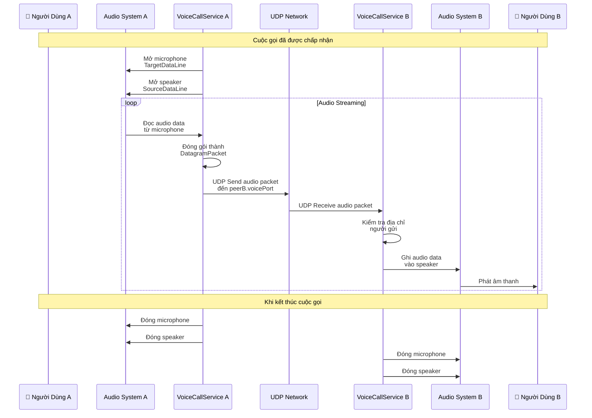
```mermaid
sequenceDiagram
    participant UserA as 👤 Người Dùng A
    participant AudioA as Audio System A
    participant VoiceA as VoiceCallService A
    participant Network as UDP Network
    participant VoiceB as VoiceCallService B
    participant AudioB as Audio System B
    participant UserB as 👤 Người Dùng B
    
    Note over UserA,UserB: Cuộc gọi đã được chấp nhận
    
    VoiceA->>AudioA: Mở microphone<br/>TargetDataLine
    VoiceA->>AudioA: Mở speaker<br/>SourceDataLine
    
    loop Audio Streaming
        AudioA->>VoiceA: Đọc audio data<br/>từ microphone
        VoiceA->>VoiceA: Đóng gói thành<br/>DatagramPacket
        VoiceA->>Network: UDP Send audio packet<br/>đến peerB.voicePort
        Network->>VoiceB: UDP Receive audio packet
        VoiceB->>VoiceB: Kiểm tra địa chỉ<br/>người gửi
        VoiceB->>AudioB: Ghi audio data<br/>vào speaker
        AudioB->>UserB: Phát âm thanh
    end
    
    Note over UserA,UserB: Khi kết thúc cuộc gọi
    VoiceA->>AudioA: Đóng microphone
    VoiceA->>AudioA: Đóng speaker
    VoiceB->>AudioB: Đóng microphone
    VoiceB->>AudioB: Đóng speaker
```

---

## 3. Tóm Tắt Luồng Hoạt Động Tổng Quan

### 3.1. Luồng Khởi Động Ứng Dụng

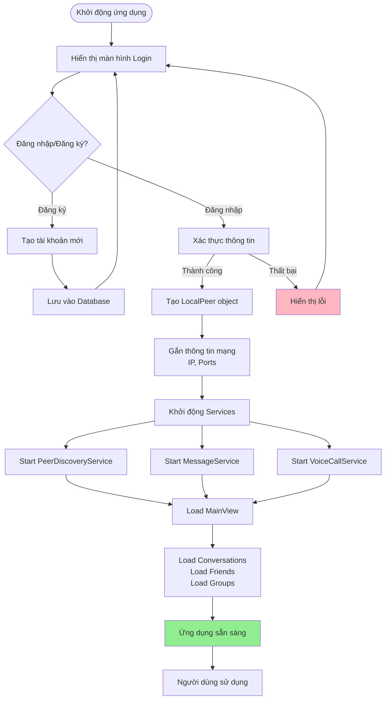
```mermaid
flowchart TD
    Start([Khởi động ứng dụng]) --> Login[Hiển thị màn hình Login]
    Login --> Auth{Đăng nhập/Đăng ký?}
    
    Auth -->|Đăng ký| Register[Tạo tài khoản mới]
    Register --> SaveUser[Lưu vào Database]
    SaveUser --> Login
    
    Auth -->|Đăng nhập| Validate[Xác thực thông tin]
    Validate -->|Thành công| CreatePeer[Tạo LocalPeer object]
    Validate -->|Thất bại| Error1[Hiển thị lỗi]
    Error1 --> Login
    
    CreatePeer --> AttachNetwork[Gắn thông tin mạng<br/>IP, Ports]
    AttachNetwork --> StartServices[Khởi động Services]
    
    StartServices --> Discovery[Start PeerDiscoveryService]
    StartServices --> Message[Start MessageService]
    StartServices --> Voice[Start VoiceCallService]
    
    Discovery --> Main[Load MainView]
    Message --> Main
    Voice --> Main
    
    Main --> LoadData[Load Conversations<br/>Load Friends<br/>Load Groups]
    LoadData --> Ready[Ứng dụng sẵn sàng]
    Ready --> Use[Người dùng sử dụng]
    
    style Ready fill:#90EE90
    style Error1 fill:#FFB6C1
```

### 3.2. Luồng Xử Lý Tin Nhắn Đến

```mermaid
flowchart TD
    Start([Nhận UDP packet]) --> Parse[Parse JSON thành Message]
    Parse --> Type{Loại Message?}
    
    Type -->|TEXT/GROUP_TEXT| Text[Text Message Handler]
    Type -->|FILE_META| File[File Meta Handler]
    Type -->|IMAGE| Image[Image Handler]
    Type -->|FRIEND_REQUEST| Friend[Friend Request Handler]
    Type -->|CALL_REQUEST| Call[Call Request Handler]
    Type -->|HEARTBEAT| Heartbeat[Heartbeat Handler]
    
    Text --> FindConv[Tìm/Create Conversation]
    FindConv --> AddMsg[Add message vào conversation]
    AddMsg --> CheckOpen{Conversation<br/>đang mở?}
    CheckOpen -->|Có| Display[Hiển thị trong UI]
    CheckOpen -->|Không| Unread[Tăng unread count]
    Display --> End([Kết thúc])
    Unread --> End
    
    File --> ReceiveFile[Nhận file qua TCP]
    Image --> ReceiveFile
    ReceiveFile --> SaveFile[Lưu file]
    SaveFile --> Display
    
    Friend --> ShowDialog[Hiển thị dialog<br/>"Friend Request"]
    ShowDialog --> End
    
    Call --> ShowCallDialog[Hiển thị call dialog]
    ShowCallDialog --> End
    
    Heartbeat --> UpdatePeer[Update/Create Peer]
    UpdatePeer --> End
    
    style Display fill:#90EE90
```

---

## 4. Các Thành Phần Chính và Trách Nhiệm

### 4.1. Components và Trách Nhiệm

| Component | Trách Nhiệm |
|-----------|-------------|
| **P2PApplication** | Khởi tạo ứng dụng, quản lý Stage, điều phối Services |
| **LoginController** | Xử lý đăng nhập/đăng ký, xác thực người dùng |
| **MainController** | Controller chính, quản lý UI, xử lý các tương tác người dùng |
| **AddFriendController** | Quản lý dialog thêm bạn bè |
| **CallController** | Quản lý giao diện cuộc gọi |
| **PeerDiscoveryService** | Khám phá peers trong LAN, quản lý heartbeat |
| **MessageService** | Gửi/nhận tin nhắn qua UDP |
| **VoiceCallService** | Quản lý cuộc gọi thoại/video, audio streaming |
| **FileTransferService** | Gửi/nhận file qua TCP |
| **UserDAO** | Truy cập database cho users |
| **FriendDAO** | Truy cập database cho friends |
| **GroupDAO** | Truy cập database cho groups |

### 4.2. Message Types và Mục Đích

| Message Type | Mục Đích |
|--------------|----------|
| **HEARTBEAT** | Phát hiện peers online trong LAN |
| **TEXT** | Tin nhắn văn bản giữa 2 peers |
| **GROUP_TEXT** | Tin nhắn văn bản trong nhóm |
| **IMAGE** | Gửi hình ảnh |
| **FILE_META** | Metadata của file (tên, size, port) |
| **FRIEND_REQUEST** | Lời mời kết bạn |
| **FRIEND_ACCEPT** | Chấp nhận lời mời kết bạn |
| **UNFRIEND** | Hủy kết bạn |
| **GROUP_INVITE** | Mời vào nhóm |
| **GROUP_DELETE** | Xóa nhóm |
| **CALL_REQUEST** | Yêu cầu cuộc gọi |
| **CALL_ACCEPT** | Chấp nhận cuộc gọi |
| **CALL_REJECT** | Từ chối cuộc gọi |
| **CALL_END** | Kết thúc cuộc gọi |
| **RECALL** | Thu hồi tin nhắn |
| **READ_RECEIPT** | Đánh dấu đã đọc |

---

## 5. Ports và Protocols

### 5.1. Ports Sử Dụng

| Port | Mục Đích | Protocol |
|------|----------|----------|
| **4446** | Multicast Discovery (Heartbeat) | UDP Multicast |
| **52000-52999** | Text Message Port (Random) | UDP |
| **53000-53999** | Voice Port (TextPort + 1) | UDP |
| **54000-54999** | Signal Port (TextPort + 2) | UDP |
| **55000-55999** | File Transfer Port (Random) | TCP |
| **56000-56999** | Image Transfer Port (Random) | TCP |

### 5.2. Network Flow

```mermaid
graph LR
    A[Peer A] -->|Multicast 230.0.0.1:4446<br/>HEARTBEAT| M[Multicast Group]
    B[Peer B] -->|Multicast| M
    C[Peer C] -->|Multicast| M
    M -->|Broadcast| A
    M -->|Broadcast| B
    M -->|Broadcast| C
    
    A -->|Unicast UDP<br/>Text Port| B
    A -->|Unicast UDP<br/>Signal Port| B
    A -->|Unicast UDP<br/>Voice Port| B
    A -->|TCP<br/>File Port| B
```

---

## 6. Database Schema và Quan Hệ

### 6.1. Entity Relationship

```mermaid
erDiagram
    USERS ||--o{ FRIENDS : "owner"
    USERS ||--o{ FRIENDS : "friend"
    USERS ||--o{ GROUPS : "owner"
    GROUPS ||--o{ GROUP_MEMBERS : "has"
    USERS ||--o{ GROUP_MEMBERS : "member"
    
    USERS {
        string peer_id PK
        string username UK
        string password
        timestamp created_at
    }
    
    FRIENDS {
        string owner FK
        string friend FK
        timestamp created_at
    }
    
    GROUPS {
        string id PK
        string name
        string owner FK
        timestamp created_at
    }
    
    GROUP_MEMBERS {
        string group_id FK
        string member FK
        timestamp joined_at
    }
```

---

## 📝 Kết Luận

Tài liệu này mô tả chi tiết:
- ✅ **Sơ đồ Use Case** cho tất cả các chức năng chính
- ✅ **Luồng hoạt động** (Sequence Diagram, Activity Diagram) cho từng chức năng
- ✅ **Các thành phần** và trách nhiệm của chúng
- ✅ **Message types** và mục đích sử dụng
- ✅ **Network architecture** và ports sử dụng
- ✅ **Database schema** và quan hệ

Tài liệu này giúp hiểu rõ cách ứng dụng hoạt động và có thể sử dụng làm tài liệu thiết kế hệ thống.

